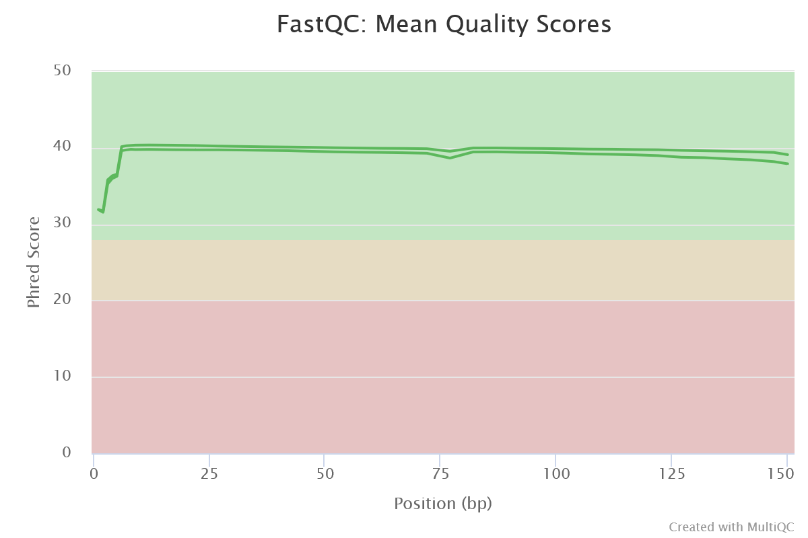

# Genome Analysis

## Aim of project
The aim of this project is to reproduce some of the results from ["The draft genome of tropical fruit durian (Durio zibethinus)" by Bin Tean Teh et al](https://www.nature.com/articles/ng.3972/). Scaffold 10 will be analysed instead of the entire genome.

## Pipeline
1. pacbio_canu_assembly.sh to assemble the PacBio reads with Canu. Output: /analysis/assembly/pacbio_canu/02_canu_assembly/
2. fastqc_illumina.sh to perform a quality control with FastQC on the Illumina reads. Output: /analysis/pre_processing/fastqc/illumina/
3. bwa_alignment.sh to align the PacBio assembly with the Illumina reads using BWA. Output: /data/alignment/illumina_pacbio/
4. pilon_improvement.sh to improve the assembly using the aligned Illumina reads with Pilon. Output: /data/assembly/pilon_improvement/
5. quast.sh to evalute the Pilon improvement. Output: /analysis/quast/
6. trimmomatic.sh to trim the RNA reads. Output: /data/raw_data/transcriptome/trimmed/SRR6040095_scaffold_10.1U.fastq.gz (.1P/2U/2P)
7. fastqc_rna.sh to perfrom a quality control with FastQC on the RNA reads. Output: /analysis/pre_processing/fastqc/rna/
8. star_01.sh to map the RNA reads to the Pilon improved assembly. Output: /proj/g2021012/nobackup/work/ida/
9. braker.sh to make a structural annotation of the genome assembly 
10. EggNogMapper to a functional annotation of the genome assembly. Other students had trouble with the online version so I used the command line version instead.
11. HTSeq to count the reads mapped to each gene
12. Deseq2 to perform a expression analysis between different parts of the fruit to determine up- and down regulation of the genes

## Analyses

### Quality control and pre-processing of Illumina reads
To summarize the FastaQC results on the provided Illumina reads in one file and get an overview of the tests, I ran MultiQC on the output files. The resulting report from MultiQC can be found in [multiqc_report.html](analysis/pre_processing/fastqc/illumina/multiqc/multiqc_report.html). Illumina reads with 1P in the name are paired forward reads, 1U are unpaired forward reads, 2P are paired reverse reads and 2U are unpaired reverse reads.

The provided paired Illumina reads appeared to already be pre-processed since no adapters were found and the sequences had high phred scores (high probabilty of the base being correct) as seen in the image below, so therefore I skipped trimming them. Had I done so I would have run Trimmomatic followed by another FastQC analysis and compared the results to the FastQC analysis to see if there was any significant improvements gained from trimming the reads.

### Assembly of PacBio reads

### Alignment of PacBio assembly and Illumina reads
To be able to correct the Canu assembly of the PacBio reads using the Illumina reads, they were aligned to the assembly by running BWA on the assembly and the Illumina reads.

The .sam file that BWA returns is converted to .bam format containing the same information, but encoded in binary so the file is smaller.

### Improving of PacBio assembly with Illumina reads
The PacBio assembly was improved with the aligned Illumina reads using Pilon. Pilon takes a .fasta file together with a sorted .bam file of aligned reads, compares them and improve sequences where the assembly and Illumina reads differ, and outputs a fasta file containing the improved genome sequence.

Since Pilon needs the .bam file to be sorted and the .bam file converted from the .sam file that the BWA alignment returned isn't, the script first sorts the .bam file with 'samtools sort'. This chould have been done in a pipe when running the BWA alignment, perhaps like this:
bwa sampe $assembly aln_illumina_1.sai aln_illumina_2.sai $illumina_1 $illumina_2 > illumina_pacbio_alignment.sam | samtools view -b -@ 1 illumina_pacbio_alignment.sam > illumina_pacbio_alignment.bam | samtools sort -@ 2 illumina_pacbio_alignment.bam -o illumina_pacbio_alignment_sorted.bam

This would mean that the .sam output from BWA would be piped through and converted to a .bam file which would be piped through again and sorted. This would only create the final sorted .bam file and not the intermediary ones which would have been nice.

In order to track changes made by Pilon I used the argument '--changes' to output a .change file with all changes made in addition to the .fasta file.

### Masking of repeated sequences

### Quality control and pre-processing of RNA reads
Both trimmed and untrimmed RNA reads were provided and I decided to trim the reads myself with Trimmomatic, where the Illumina tags and reads with a quality score under 3 were removed. After the trimming a quality control using FastQC was performed, just as for the DNA reads.

### Mapping of RNA reads
The trimmed RNA reads were mapped using STAR.

# Annotation
Braker was used annotate the assembly, however the script didn't work and there was no output because both the gtf hints and gff were empty. Because of this I downloaded the full [gff file](https://www.ncbi.nlm.nih.gov/assembly/GCF_002303985.1) from NCBI and extracted scaffold 10 (NW_019167827.1) using the function GFF_split_into_scaffolds from the PopGenome package in R.
